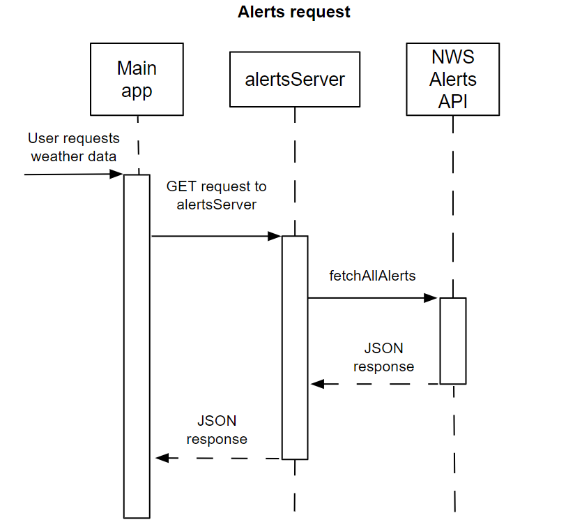

# Weather alerts microservice communication contract

## Request data
Send local GET requests for state or city data in the following formats:

State:<br>
http://localhost:3450/alerts/state/TX

City:<br>
http://localhost:3450/alerts/city/Brown-TX


## Receive data
The data will be received in JSON format -- specifically as an array of alert objects in the following format:

```
[
    {
        "areas": "Reno, NV",
        "headline": "Server flooding in Reno, NV",
        "description": "Severe flooding expected in Reno, NV. Stay indoors!"
    },
    {
        ...
    }
]
```

## UML sequence diagram
